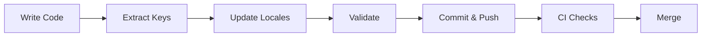
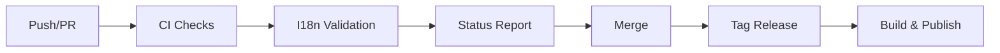

# 🌍 bevy_i18n CI/CD Setup

This repository includes a comprehensive CI/CD pipeline for internationalization (i18n) workflows with automated validation and release management.

## 🚀 Quick Start

### For Developers

1. **Add translation keys in code**:
   ```rust
   commands.spawn((
       Text::new(""),
       T::new("game.title"),
       T::with_vars("player.greeting", &[("name", "Hero")]),
   ));
   ```

2. **Extract and validate**:
   ```bash
   ./scripts/extract-i18n.sh    # Generate template
   ./scripts/validate-i18n.sh   # Validate locales
   ```

3. **Update translations** in `assets/locales/*.yaml`

### For CI/CD

The GitHub Actions workflow automatically:
- ✅ Runs tests on all Rust versions
- ✅ Checks formatting and linting
- ✅ Validates i18n locale files
- ✅ Reports coverage statistics
- ✅ Publishes releases on version tags

## 📁 CI/CD Structure

```
.github/
├── workflows/
│   ├── ci.yml          # Main CI pipeline
│   ├── i18n.yml        # I18n validation pipeline
│   ├── release.yml     # Release automation
│   └── dependabot.yml  # Dependency updates
scripts/
├── extract-i18n.sh     # Extract translation keys
└── validate-i18n.sh    # Validate locale files
docs/
├── CI_CD.md           # Detailed CI/CD documentation
└── WORKFLOW.md        # I18n workflow guide
assets/
└── locales/
    ├── en.yaml        # English translations
    └── zh.yaml        # Chinese translations
```

## 🛠️ Available Tools

### i18n-extract

Scans Rust source code for translation keys and generates YAML templates.

```bash
cargo run --bin i18n-extract -- src locales/template.yaml
```

**Detects**:
- `T::new("key")`
- `T::with_vars("key", &[("var", "val")])`
- `T::plural("key", count)`
- `T::with_context("key", "context")`
- `T::ns("namespace").key("key")`

### i18n-validate

Validates locale files for consistency and completeness.

```bash
cargo run --bin i18n-validate -- assets/locales
```

**Validates**:
- Missing keys across locales
- Variable placeholder consistency
- Key presence in all locales

## 🔄 Workflow Integration

### Development Workflow



### CI/CD Pipeline



## 📊 Status & Badges

[](https://github.com/zazac-zhang/bevy-i18n/actions)
[](https://github.com/zazac-zhang/bevy-i18n/actions)

## 🎯 Key Features

### Automated I18n Validation
- Extracts keys from source code automatically
- Validates locale consistency on every PR
- Comments validation results on PRs
- Provides coverage statistics

### Release Automation
- Creates GitHub releases on version tags
- Publishes to crates.io
- Builds cross-platform binaries
- Deploys documentation to GitHub Pages

### Developer Experience
- Simple shell scripts for common tasks
- Clear error messages and validation reports
- Template generation for new locales
- Dependency updates via Dependabot

## 📖 Documentation

- **[CI/CD Guide](docs/CI_CD.md)**: Complete CI/CD pipeline documentation
- **[Workflow Guide](docs/WORKFLOW.md)**: Detailed i18n workflow instructions
- **[Main README](README.md)**: Project overview and usage

## 🔧 Configuration

### Required Secrets

For release automation, configure these in GitHub Settings:

- `CARGO_REGISTRY_TOKEN`: crates.io authentication token

### Optional Configuration

- Customize validation rules in `.github/workflows/i18n.yml`
- Adjust release targets in `.github/workflows/release.yml`
- Modify CI matrix in `.github/workflows/ci.yml`

## 🚦 Release Process

1. Update version in `Cargo.toml`
2. Commit: `git commit -m "Bump version to X.Y.Z"`
3. Tag: `git tag vX.Y.Z`
4. Push: `git push origin vX.Y.Z`
5. GitHub Actions handles the rest!

## 🤝 Contributing

1. Fork the repository
2. Create a feature branch
3. Add translation keys as needed
4. Run `./scripts/validate-i18n.sh`
5. Submit a PR (auto-validated by CI)

## 📝 License

MIT OR Apache-2.0 (same as main project)

---

**Note**: This CI/CD setup is production-ready and handles the complete i18n lifecycle from development to release.
